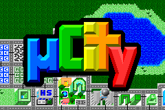
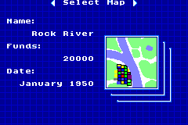
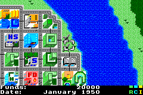

# Sapphire

[](https://github.com/dbut2/sapphire/actions/workflows/quality.yaml)

Sapphire is an emulator for the Game Boy Advance (GBA) system written in Go.


You can play Sapphire in the browser at [dylanbutler.dev/blog/sapphire](https://dylanbutler.dev/blog/sapphire/) — the emulator compiles to WebAssembly (`make wasm`) and the blog post embeds a playable build.

## Screenshots

| | | |
|---|---|---|
|  |  |  |

The recording and screenshots show [uCity Advance](https://github.com/AntonioND/ucity-advance), an open-source city builder for the GBA.

## Status

Implemented:

- ARM7TDMI CPU: full ARM and THUMB instruction sets, with HLE BIOS (SWI calls including CpuSet and LZ77 decompression)
- Memory bus covering the GBA address map, with hardware quirks like region mirroring and rotated misaligned reads
- Video: display modes 0–5, text and affine backgrounds, sprites (including affine), windows, alpha blending and brightness effects
- DMA: immediate, VBlank, HBlank and sound FIFO timing
- Timers with cascade, interrupts
- Audio: all 4 PSG channels plus both Direct Sound FIFO channels; output is wired up in the browser build (works on iPhone), the desktop build is currently silent
- Cartridge: Flash saves (64 KB Panasonic / 128 KB Sanyo, auto-detected), SRAM, real-time clock via GPIO
- Frontends: macOS desktop (Fyne) and browser (WebAssembly)

Not implemented / known issues:

- Object window (OBJWIN)
- EEPROM saves
- Serial / link cable
- Timing is approximate rather than cycle-accurate, and some homebrew (Butano-based games, for example) hits CPU edge cases and fails to run

Games known to boot:

- Pokémon Sapphire — playable; this is the game the browser build runs
- uCity Advance — playable; shown above

## Requirements

To run Sapphire, you will need a Game Boy Advance BIOS file (`bios.gba`). This file should be placed in the `gba/` directory before building, or you can use the `make decrypt` command if you have the encrypted version and the necessary key.

## Installation

To install Sapphire, you can clone the repository and build it from source:

```bash
git clone https://github.com/dbut2/sapphire.git
cd sapphire
make build
```

This will compile the emulator and create an executable in the `build/` directory, and also package it into `Sapphire.app`.

## Usage

To run a GBA game, you will need the game ROM file. Once you have it, you can run Sapphire and load the game as follows:

```bash
./Sapphire.app/Contents/MacOS/sapphire --game /path/to/game.gba
```

Alternatively, if you have not provided the path to the ROM file using the `--game` flag, a file dialog will prompt you to select the game ROM file to load.

Ensure the ROM file is a `.gba` file that represents a Game Boy Advance game.

### Controls

| GBA Button | Keyboard Key |
|------------|--------------|
| A          | Z            |
| B          | X            |
| L          | A            |
| R          | S            |
| Start      | Enter        |
| Select     | Backspace    |
| D-Pad      | Arrow Keys   |
| Fast Forward| Space       |

## Development

Sapphire is a work in progress, and contributions are welcome.

For development, besides the standard Go tools, Sapphire includes a `Makefile` that simplifies common tasks:

- `make clean` - Remove any build artifacts.
- `make build` - Build the project for macOS.
- `make wasm` - Build the project for WebAssembly.
- `make run` - Build and execute the project for macOS.
- `make package` - Package the built binary for distribution.
- `make test` - Run tests.
- `make lint` - Run linter to check the code.
- `make decrypt` - Decrypt BIOS and default gamepak (requires `SAPPHIRE_KEY`).

### References

Hardware documentation used to build Sapphire:

- [GBATEK](https://problemkaputt.de/gbatek.htm) — GBA hardware reference
- [ARM7TDMI Technical Reference Manual (DDI 0029)](https://developer.arm.com/documentation/ddi0029/latest/)
- [ARM Architecture Reference Manual (DDI 0100)](https://developer.arm.com/documentation/ddi0100/latest/)

## License

Sapphire is licensed under the [MIT License](LICENSE).
